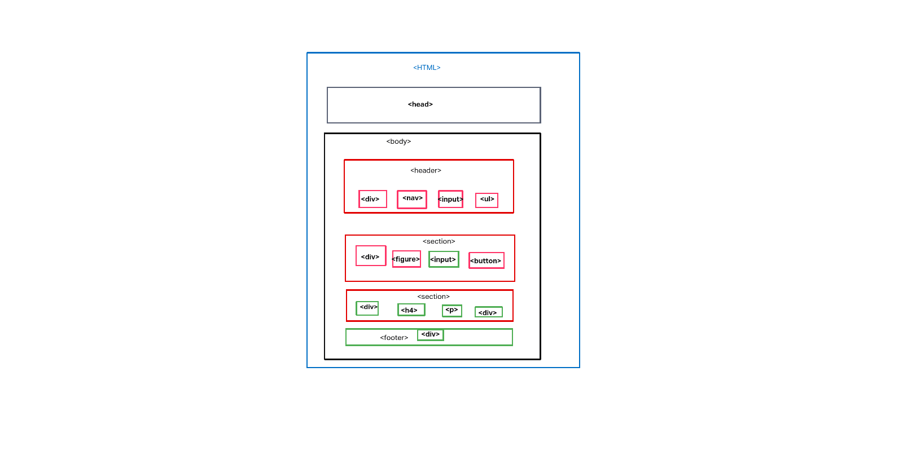

# Development Strategy

> `semantic layout`

A basic web page with semantic layout, developed collaboratively using branches.  It's not very interesting to look at.

## WireFrame

## 0.set-up
_A user can see my initial repository and live demo just right hand of repo under About.

---

## Repository 

1. Created a new repository [generated](https://github.blog/2019-06-06-generate-new-repositories-with-repository-templates/) from [this template](https://github.com/galalkoro/connexa/tree/development-strategy)
1.  Clone the repository
1. Copy-paste the markdown from this file to the empty `development-strategy.md` file in the new repo
1. Add [this wireframe](./wireframe.png) into your new repo
1. Start your README file
1. Push the changes
1. turn on GitHub Pages
---

## 1. Title 

__As a site visitor, I want to know what the web page is called__

> assigned to Galal

### Repository 

1. This user story was developed locally by `Galal` on a branches called `home-page, development-strategy`.
1. The new branch was pushed to the shared repository.
1. A pull request was made to `main` & reviewed by the team.
1. Changes were merged to `main`.

### HTML
- A header element with a title describing the web page, navigations 
- Carousel rotate.
- A pleasant footer

### SCSS to import to css file `@imprt './home'`
- Layout styling for the header, footer & Carousel 
- Text styling for the main title
- BootStrap link 

### JavaScript
- In orde to continue the process of rotate on the cards need carousel js file.

---
## 2. About 
__As a site visitor, I want to read about  this web page__
> assigned to Brain 
### Repository

1. This user story was developed locally by `Brain` on a braches called `aboutpage, Brain & Beforefinal`.
1. The new branch was pushed to the shared repository
1. A pull request was made to `main` & reviewed by the team
1. Changes were merged to `main`

### HTML
- header & navigation
- section elements
- some nice text in the cards introducing users to this what web page about
- parallax scrolling

### SCSS to import to css file `@import ./about`

 - Styling for the new element
- parallax styling 
---

## 3. Services page 
__As a site visitor, I want to know what connexa's services__
> assigned to __Cyraz__

### Repository

1. This user story was developed locally by __Cyraz__ on a branches called `cyraz & services`.
1. The new branch was pushed to the shared repository
1. A pull request was made to `main` & reviewed by the team
1. Changes were merged to `main`

### HTML

- A header element with a title describing the web page, navigation's 
- BootStrap & placed some images 

### CSS

- BootStrap restyle in HTML file.

---

## 4. Contact Page 

__As a site visitor, I want to know where I can get in touch__

> assigned to __Klarida__

### Repository

1. This user story was developed locally by `Kalarida` on a branches called `klarida & contact`.
1. The new branch was pushed to the shared repository
1. A pull request was made to `main` & reviewed by the team
1. Changes were merged to `main`

### HTML

- `<h2>` element
- ` <i class>` for phone
- `<button>` for Email 
- some phones number & email pf pages 

### CSS

- styled in HTML file for the font-sizes
### scss to import `@import './klarida' `
-  styling to centre the page contact

---
## 5. Finishing Touches

__As a perfectionist, I want everything perfect :)__

- Write final, complete README:
  - [makeareadme.com](https://www.makeareadme.com/)
  - [bulldogjob](https://bulldogjob.com/news/449-how-to-write-a-good-readme-for-your-github-project)
  - [meakaakka](https://medium.com/@meakaakka/a-beginners-guide-to-writing-a-kickass-readme-7ac01da88ab3)
- Check for styling errors with a linter & prettify code
- Validate source code on w3 to check for any last mistakes
